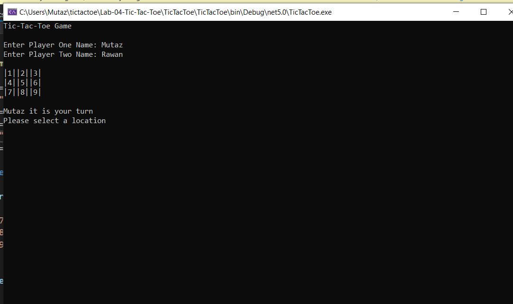
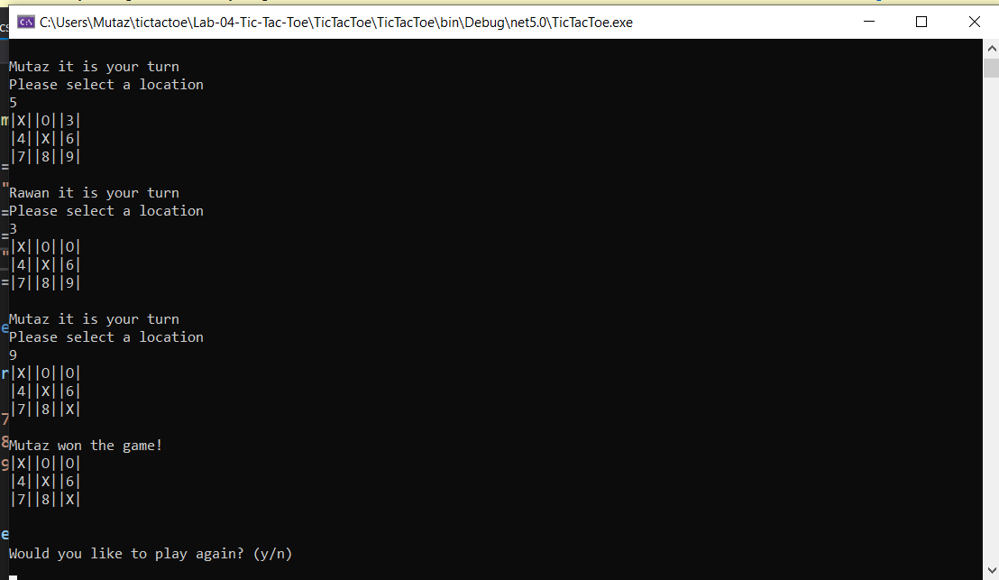
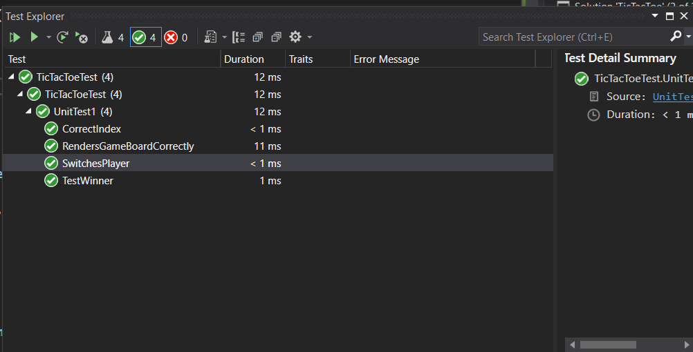

# Lab-04-Tic-Tac-Toe

## Description
This is a two (2) person, turn based Tic-Tac-Toe console application that will demonstate basic understanding of C# classes and objects. This application was built off form starter code provided from the class repo.

## Visuals

Start game

---

End game

---

Tests
